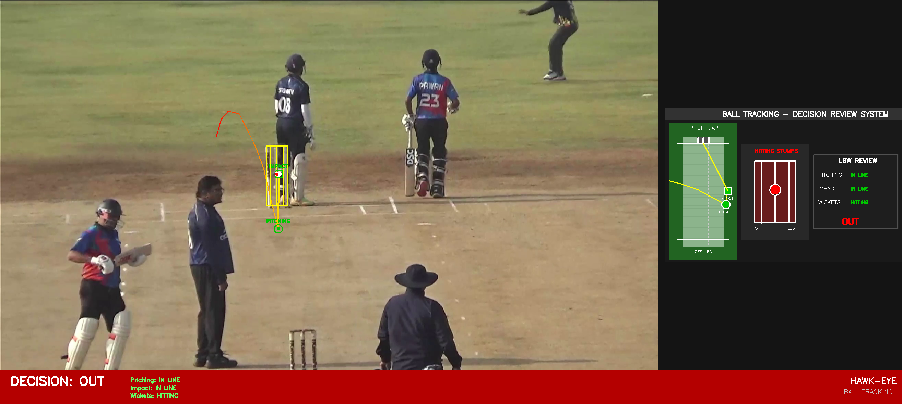

# Cricket LBW DRS - Decision Review System

A professional cricket LBW (Leg Before Wicket) Decision Review System that generates **international broadcast-style visualizations**. This tool allows you to analyze cricket deliveries and determine LBW decisions with Hawk-Eye style graphics.



## Features

- **Interactive Ball Tracking** - Frame-by-frame ball position marking
- **Pitching Point Detection** - Mark where the ball pitches
- **Impact Point Detection** - Mark where the ball hits the pad
- **Wicket Zone Visualization** - Shows ball projection on stumps
- **Pitch Map** - Bird's eye view of the pitch with trajectory
- **Professional DRS Panel** - International broadcast-style graphics
- **Umpire's Call Support** - Handles borderline decisions
- **Projected Path** - Shows predicted ball path from impact to stumps

## LBW Rules Implemented

The system follows official ICC LBW rules:
1. **Pitching** - Ball must pitch in line with stumps (not outside leg)
2. **Impact** - Ball must hit pad in line with stumps
3. **Wickets** - Ball must be going on to hit the stumps

## Installation

### Prerequisites
- Python 3.8 or higher
- pip (Python package manager)

### Setup

```bash
# Clone the repository
git clone https://github.com/YOUR_USERNAME/LBW_DRS_Project.git
cd LBW_DRS_Project

# Create virtual environment (recommended)
python -m venv venv
source venv/bin/activate  # On Windows: venv\Scripts\activate

# Install dependencies
pip install -r requirements.txt
```

## Usage

### Step 1: Mark Ball Trajectory

Run the interactive tracker with your cricket video:

```bash
python interactive_tracker.py your_video.mp4
```

### Interactive Controls

| Key | Action |
|-----|--------|
| **Left Click** | Mark ball position at current frame |
| **P** | Mark PITCHING point (where ball bounces) |
| **I** | Mark IMPACT point (where ball hits pad) |
| **W** | Mark WICKETS (click top-left, then bottom-right) |
| **N / →** | Next frame |
| **B / ←** | Previous frame |
| **J** | Jump to specific frame |
| **U** | Undo last point |
| **C** | Clear all markings |
| **S** | Save and generate DRS output |
| **Space** | Play/Pause video |
| **Q / Esc** | Quit |

### Step 2: View Results

After pressing **S** to save, the system automatically generates:
- `output/drs_output.mp4` - Full DRS visualization video
- `output/drs_output_final.png` - Final decision frame

### Generate DRS Output Separately

If you've already saved trajectory data:

```bash
python drs_international.py
```

## Project Structure

```
LBW_DRS_Project/
├── interactive_tracker.py    # Interactive ball tracking tool
├── drs_international.py      # DRS visualization generator
├── requirements.txt          # Python dependencies
├── trajectory_data.json      # Saved trajectory data (auto-generated)
├── output/                   # Generated outputs
│   ├── drs_output.mp4       # Output video
│   └── drs_output_final.png # Final frame
└── README.md
```

## Output Visualization

The generated output includes:

1. **Main Video Frame** - Original video with ball tracking overlay
2. **Trajectory Trail** - Yellow/red line showing ball path
3. **Pitching Point** - Green circle where ball bounces
4. **Impact Point** - Green square where ball hits pad
5. **Projected Path** - Red/green dots showing predicted path to stumps
6. **Pitch Map** - Bird's eye view of the pitch
7. **Wicket View** - Front view of stumps with ball position
8. **Decision Panel** - Shows Pitching, Impact, Wickets status and final decision

## Decision Logic

| Condition | Result |
|-----------|--------|
| Pitched outside leg stump | NOT OUT |
| Impact outside off/leg stump | NOT OUT |
| Ball missing stumps | NOT OUT |
| Ball hitting stumps | OUT |
| Borderline (within margin) | UMPIRE'S CALL |

## Sample Output

The system generates professional broadcast-style graphics:

- **Red** indicates OUT / Hitting
- **Green** indicates NOT OUT / In Line / Missing
- **Orange** indicates Umpire's Call

## Requirements

```
opencv-python>=4.5.0
numpy>=1.19.0
```

## Technical Details

- **Video Processing**: OpenCV for frame extraction and rendering
- **Trajectory Calculation**: Linear interpolation between marked points
- **Projection**: Horizontal projection from impact point to stump line
- **Visualization**: Custom DRS panel with pitch map and wicket view

## Contributing

Contributions are welcome! Please feel free to submit a Pull Request.

## License

This project is open source and available under the [MIT License](LICENSE).

## Acknowledgments

- Inspired by the Hawk-Eye DRS system used in international cricket
- Built for educational and demonstration purposes

## Author

Created with ❤️ for cricket enthusiasts
